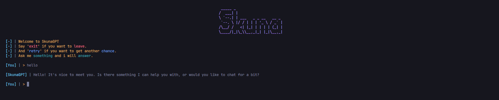

<h1 align="center">Better Ui Py</h1>

  <b>🖤 Follow me here:</b> 
  <a href="https://github.com/lutherantz">Github</a>
   
   
  

#

## Screen:

Tools make with this !

#

## ✨ Thanks

Don't Forget to Star the project !
